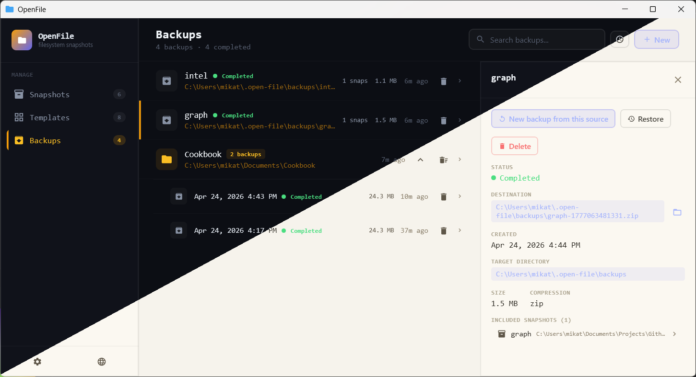

# OpenFile

[](https://github.com/mtresnik/open-file/blob/main/LICENSE)
[](https://github.com/mtresnik/open-file/releases/tag/v0.0.1)
[](https://makeapullrequest.com)
<hr>

A desktop tool for tracking, backing up, and scaffolding your working
files. Ships with a Compose Desktop UI and a parallel CLI — the two
share the same services and persistence, so whatever you do from the
app you can also do from the command line.



Three core concepts:

- **Snapshots** — a hashed, indexed tree of a directory at a point in
  time. Cheap to record, useful for diffing or for pinning a backup
  to a known-good state.
- **Backups** — a compressed zip of a directory, optionally scheduled
  to run on an interval or a cron expression. Can be restored into
  any destination.
- **Templates** — reusable project scaffolds. Built-ins cover common
  stacks (Kotlin + Gradle, Rust, Node, Python, Go, …) and you can
  save your own directories as templates.

Both surfaces persist into a SQLite database under
`~/.open-file/` (or the OS equivalent).

## Getting started

Requirements: JDK 17+ (the packaged desktop distribution bundles its
own runtime). On Linux you'll also want `xdg-open` for reveal-in-
file-manager support.

### Desktop UI

```bash
./gradlew :desktop-ui:run
```

For a native distributable (`.dmg` / `.msi` / `.deb`):

```bash
./gradlew :desktop-ui:packageDistributionForCurrentOS
```

### CLI

Build the CLI distribution:

```bash
./gradlew :apps:cli:installDist
```

Then run it from `build/install/openfile/bin/openfile` (or alias it
onto your PATH). Same shape for every domain:

```
openfile snapshot --list
openfile snapshot --new --path ~/my-project
openfile snapshot --delete --id <uuid>

openfile backup --list
openfile backup --new --path ~/my-project [--target /mnt/external/backups] [--no-hidden]
openfile backup --restore --id <uuid> --path /tmp/restore-target
openfile backup --delete --id <uuid>

openfile template --list
openfile template --types
openfile template --new        # interactive flow
```

`openfile <domain>` with no further args drops into an interactive
REPL for that domain. `openfile --help` lists the domains.

## Architecture

```
shared/                       interfaces + domain models + services
  core/                       CLI primitives, utils, path helpers
  snapshot/                   SnapshotService, NodeService, TreeBuilder
  template/                   TemplateFactory, models
  backup/                     BackupService, BackupArchiver
  archive/                    zip I/O (ArchiveExtractor)
  sql/                        SqlDelight wiring, shared driver

apps/
  snapshot/                   snapshot SQL DAO impl
  template/                   template SQL DAO impl
  backup/                     backup SQL DAO impl
  cli/                        `openfile` binary — dispatches
                              snapshot / template / backup verbs

desktop-ui/                   Compose Desktop app
```

`:shared:*` modules define the interfaces and business logic.
`:apps:<domain>` provides the SQL DAO that implements the DAO
contracts; it's loaded at runtime via `ServiceLoader`. The CLI and
the desktop UI each pull in the shared services plus every DAO
impl, so either surface works standalone.

## CLI option grammar

Common flags across domains:

| Flag | Meaning |
| ---- | ------- |
| `-ls`, `--list` | list all items |
| `-n`, `--new` | create a new item |
| `-d`, `--delete` | delete by `--id <uuid>` |
| `-p`, `--path` | source (or destination for `backup --restore`) |
| `-i`, `--id` | target id for delete / restore |
| `-h`, `--help` | help |
| `-q`, `--quit` | quit the REPL |

Backup-specific:

| Flag | Meaning |
| ---- | ------- |
| `-r`, `--restore` | extract a backup into `--path` |
| `--target <dir>` | archive output directory (default `~/.open-file/backups/`) |
| `--no-hidden` | exclude dotfiles / dotdirs from the archive |

## Data location

Everything OpenFile persists lives under a single app-data root:

- **Linux / macOS**: `~/.open-file/`
- **Windows**: `%USERPROFILE%\.open-file\`

Inside:

- `*.db` — SQLite files for snapshots, templates, backups
- `backups/` — default zip archive output
- `schedules/` — persisted schedule JSON
- `logs/error.log` — error reporter target
- `ui/` — preferences + theme / locale choices

The desktop UI's Settings → About section surfaces the resolved
path and includes buttons to open the folder or log file directly.

## Development

Standard Gradle. Common commands:

```bash
./gradlew build                          # compile + test everything
./gradlew :desktop-ui:run                # launch the desktop app
./gradlew :apps:cli:installDist          # build the CLI launcher
./gradlew :apps:cli:run --args="snapshot --list"
```

### Versioning

The project version is hand-kept in three places that need to stay
in lockstep when cutting a release:

- `gradle/libs.versions.toml` — `project = "1.0.0-SNAPSHOT"`. Every
  module's `version =` reads this catalog entry.
- `desktop-ui/build.gradle.kts` — `packageVersion = "1.0.0"` for
  the `.dmg` / `.msi` / `.deb` installer metadata. Must be a bare
  `major.minor.build` triple with `MAJOR >= 1` (jpackage's DMG
  validator).
- `desktop-ui/src/main/kotlin/org/open/file/ui/util/AppInfo.kt` —
  `const val VERSION = "1.0.0"` shown in the in-app About dialog.

Cutting a release:

1. Bump the three values above on a release-prep PR; merge to main.
2. Tag and push: `git tag v1.0.0 && git push origin v1.0.0`.
3. The release workflow builds and attaches binaries to the
   GitHub Release for that tag.